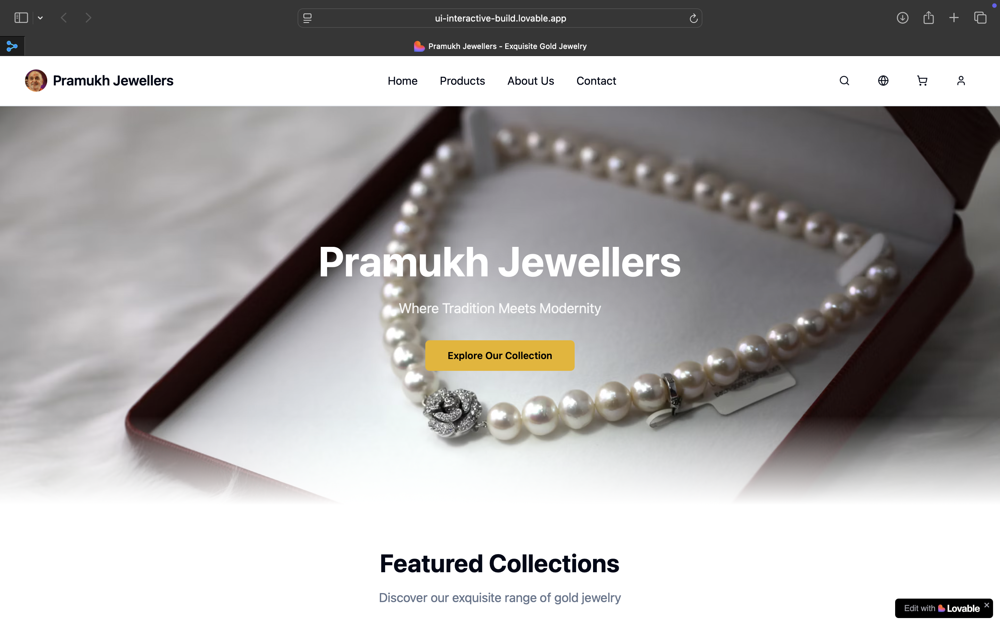

# 💎 Pramukh Jewellers Website

## 📄 Project Info

**Project URL**: [Pramukh-Jewellers](https://ui-interactive-build.lovable.app)

---
## Check Out this:



## ✏️ How Can I Edit This Code?

There are several ways to work with and modify this application:

---

### ✅ Option 1: Use **Lovable**

1. Visit the Lovable project link:
   👉 [Edit on Lovable](https://lovable.dev/projects/b82cc6a2-ca8b-49c0-922e-1a31cadfa89b)
2. Use the built-in visual and code editors to make changes.
3. All updates will be automatically committed to the connected repository.

---

### 💻 Option 2: Use Your Preferred IDE (Local Setup)

To work on the code locally using tools like **VS Code**, follow these steps:

1. **Clone the repository**
   Open your terminal and run:

   ```bash
   git clone <YOUR_GIT_URL>
   ```

   Replace `<YOUR_GIT_URL>` with the actual Git URL for your project.

2. **Navigate to the project folder**

   ```bash
   cd <project-folder>
   ```

3. **Install dependencies**
   Use your package manager (e.g., npm or yarn):

   ```bash
   npm install
   ```

   or

   ```bash
   yarn install
   ```

4. **Start the development server**

   ```bash
   npm run dev
   ```

   or

   ```bash
   yarn dev
   ```

5. Open the project in your favorite code editor (like VS Code) and start editing!
